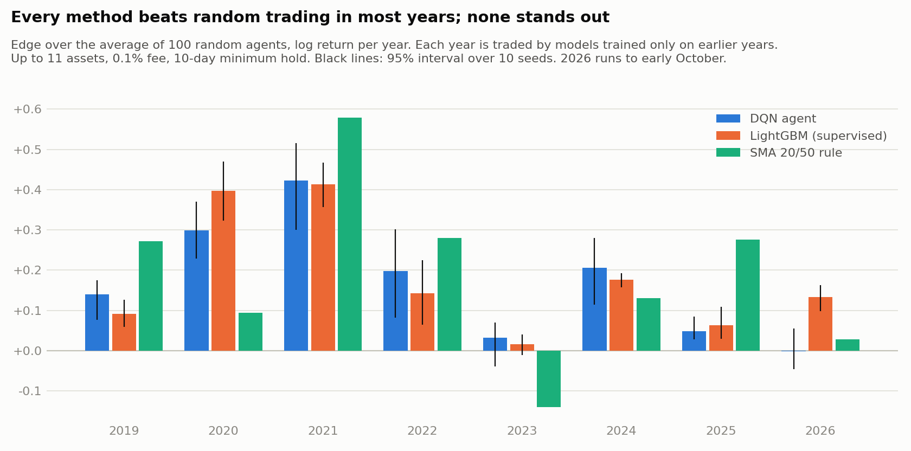
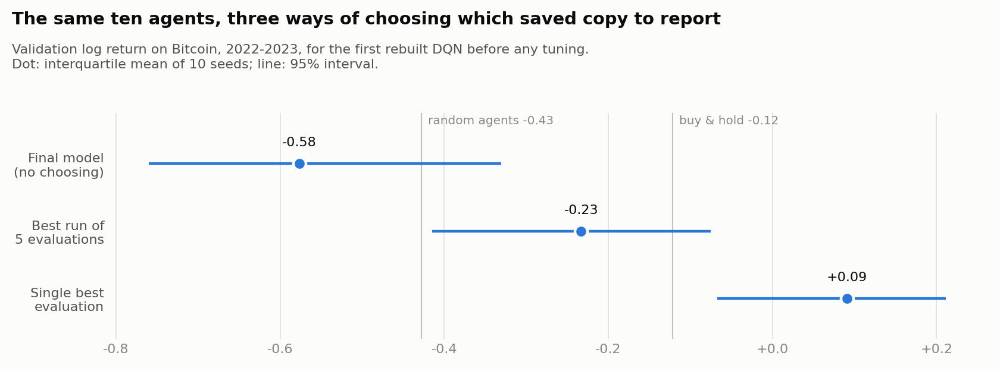
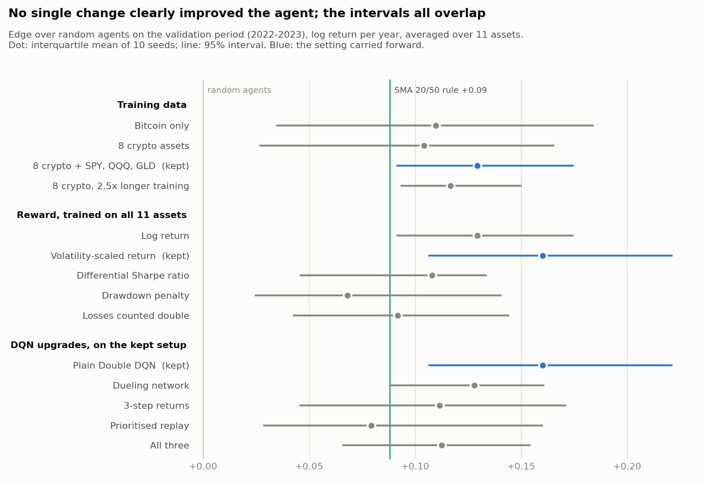

# RL-AlgoTrading

A deep reinforcement learning trading agent, rebuilt from a notebook I wrote in 2023
and then tested as hard as I could.

**The result:** across eight years of walk-forward testing on 11 assets, the agent
reliably beats random trading, roughly ties a 20/50-day moving-average rule, and is
matched by a simple supervised model. It is not a money-making bot, and this repo does
not claim it is. What it offers is a trading-RL pipeline where every number can be
trusted: a tested simulator, no look-ahead, ten seeds per experiment, confidence
intervals, and baselines that run under exactly the same rules as the agent.



## Headline results

Walk-forward test, 2019 to 2026: for each year, every model is trained only on earlier
years and then trades that year. Up to 11 assets (8 crypto, SPY, QQQ, GLD), daily bars,
0.1% fee per trade, 10-day minimum holding period, 10 seeds. Returns are log returns
per year, averaged over assets and years.

| Strategy | Log return / year | Edge over random (95% interval) | Years ahead of random | Trades per asset per year |
|---|---|---|---|---|
| Buy and hold | +0.297 | | | 1 |
| SMA 20/50 rule | +0.292 | | | about 20 |
| LightGBM (supervised) | +0.277 | +0.174 (+0.167 to +0.197) | 8 of 8 | 19.5 |
| **DQN agent** | **+0.259** | **+0.156 (+0.134 to +0.190)** | **7 of 8** | **21.3** |
| 100 random agents | +0.103 | | | |

- **The agent has a real, repeatable edge over no-skill trading.** Random agents trade
  under the same holding rule and fees, so this is not just fees saved.
- **It does not beat the simple baselines.** It trails the SMA rule by 0.033 per year
  (interval -0.055 to +0.001) and buy-and-hold by 0.038, though with far smaller losses
  in the 2022 crash (-0.37 against -0.98).
- **RL adds nothing over supervised learning here.** An untuned LightGBM model that
  takes a second to fit is nominally ahead on every measure and about twice as
  consistent across seeds.
- **Part of the edge is exposure.** The agent is invested 62% of the time and random
  agents 50%, in mostly rising markets. I estimate that accounts for 0.03 to 0.04 of
  the 0.156.

Per-year numbers are in [`docs/results/walk_forward_by_year.csv`](docs/results/walk_forward_by_year.csv).

## Where it started

The 2023 version (kept in [`legacy/`](legacy/)) was a Keras DQN trained on one year of
Bitcoin prices. Reviewing it in 2026 turned up ten problems that change the results:

1. The price file was newest-first and never sorted, so the agent traded backwards in time.
2. The state was `sigmoid(price difference in dollars)`, which is 0 or 1 for 99.5% of days.
3. The agent could not see its own position.
4. "Experience replay" always trained on the last 31 steps, not a random sample.
5. There was no target network, and 31 single-sample `fit` calls on every step.
6. The reward was `max(profit, 0)`, so losses were never penalised.
7. No cash limit, unlimited buying, no fees, and open positions ignored at the end.
8. Exploration decayed to its minimum within three episodes.
9. The agent was never evaluated: no test run, no baseline, no seeds.
10. 366 daily bars is far too little data for deep RL.

## What the rebuild does differently

- **A tested simulator.** A Gymnasium environment with target-position actions,
  execution at the next day's open, fees on every position change, and portfolio log
  return as the reward. Tests check the accounting against hand calculations.
- **No look-ahead.** Every feature uses past data only, and a test proves it by cutting
  off the future and checking that nothing changes.
- **Seeds and statistics.** Every experiment runs 10 seeds in parallel and reports the
  interquartile mean with a bootstrap 95% interval (following Agarwal et al., 2021).
  A change is kept only if it beats seed noise.
- **Baselines under the same rules.** Buy-and-hold, SMA 20/50 and 100 random agents go
  through the same environment, fees and holding rule as the agent.
- **Honest model selection.** Results are reported for the final model, not the best
  checkpoint (see below for why).
- **Walk-forward testing** and a **supervised baseline** through the same folds.

## What I learned along the way

### Picking the best checkpoint makes a worthless agent look good



The first rebuilt agent was evaluated on validation data 30 times during training.
Reporting its best evaluation gave +0.09, better than buy-and-hold. Reporting the final
model gave -0.58, worse than random. Same agents, same data: the difference of 0.67 is
pure selection bias. Every result in this repo uses the final model.

### Seven experiments, one clear win



| Experiment | What I tried | Outcome |
|---|---|---|
| Overtrading | Penalty in the reward; hard minimum holding period | The penalty barely worked. A 10-day hold cut trades from 286 to 56 and was the one clear improvement, though most of the gain was fees saved: random agents improved too |
| Overfitting | Smaller network, weight decay, layer norm, noise, shorter training, shorter window | None improved validation return. A 3-day input window removed most of the train/validation gap, so I kept it as the simpler model |
| More data | Training one agent on 8, then 11 assets | No gain in the average, but the spread across seeds roughly halved |
| Reward design | Volatility-scaled return, differential Sharpe, drawdown penalty, double-counted losses | No reward clearly raised the edge. Penalising losses taught the agent to stay out of the market, not to pick better days |
| DQN upgrades | Dueling network, 3-step returns, prioritised replay | None helped; 3-step returns increased trading |
| Walk-forward | Retrain and test year by year, 2019 to 2026 | Edge over random in 7 of 8 years |
| Supervised baseline | LightGBM predicting the 10-day return | Matches the agent with a fraction of the effort |

The pattern across all of these: when the data contains very little signal, a better
learner has nothing extra to find. Full numbers for every step are in
[`ROADMAP.md`](ROADMAP.md) and [`docs/results/`](docs/results/).

## Limitations

- **The assets are today's survivors.** I picked coins that still exist and trade
  heavily in 2026. Coins that died are missing, which flatters every strategy here.
- **Costs are simplified.** A flat 0.1% fee per trade, no slippage or market impact,
  daily bars from Yahoo Finance.
- **Long or flat only.** No shorting, no position sizing.
- **The eight coins move together**, so they are not eight independent tests.
- **Settings were chosen on 2022-2023 data**, which slightly favours those two years
  of the walk-forward test.

## Reproduce it

Requires Python 3.10+ and PyTorch.

```bash
python -m venv .venv
.venv/Scripts/python -m pip install -e .[dev]       # on Linux/macOS: .venv/bin/python
.venv/Scripts/python -m pytest                      # 22 tests of the simulator, agent and statistics
```

Price data is included in `data/`. To refresh it: `python scripts/download_data.py BTC-USD`.

```bash
# The final setup, 10 seeds, scored on all 11 assets (about 10 minutes on 8 cores)
ASSETS="BTC-USD ETH-USD SOL-USD BNB-USD XRP-USD LTC-USD ADA-USD DOGE-USD SPY QQQ GLD"
python scripts/train.py --name final --min-hold 10 --window 3 --reward vol_scaled \
    --train-symbols $ASSETS --eval-symbols $ASSETS

# Is one variant better than another, beyond seed noise?
python scripts/compare.py final other_run --period val_multi

# Walk-forward test of the agent and the supervised baseline, then compare them
python scripts/walk_forward.py --method dqn --name wf_dqn      # about 70 minutes
python scripts/walk_forward.py --method gbm --name wf_gbm      # about 3 minutes
python scripts/walk_forward.py --compare wf_dqn wf_gbm

# Rebuild the figures and tables in docs/
python scripts/make_figures.py
```

Runs are deterministic: the same seed gives the same agent.

## Layout

| Path | What it does |
|---|---|
| `src/rltrader/data.py` | Load price bars (always oldest to newest); train/validation/test dates |
| `src/rltrader/features.py` | Backward-looking, volatility-scaled features |
| `src/rltrader/env.py` | Trading environment, reward types, multi-asset training wrapper |
| `src/rltrader/dqn.py` | Double DQN, with optional dueling, n-step and prioritised replay |
| `src/rltrader/evaluate.py` | Episode runner, performance metrics, baselines |
| `src/rltrader/experiment.py` | One training run for one seed |
| `src/rltrader/walkforward.py` | Yearly folds for the agent and the LightGBM baseline |
| `src/rltrader/stats.py` | Interquartile mean, bootstrap intervals, run comparison |
| `scripts/` | Training, comparison, walk-forward, test evaluation, figures |
| `tests/` | Simulator accounting, look-ahead, agent and statistics checks |
| `docs/` | Figures and the result tables behind them |
| `legacy/` | The original 2023 notebook, data and model |

This is a research and learning project, not financial advice.
